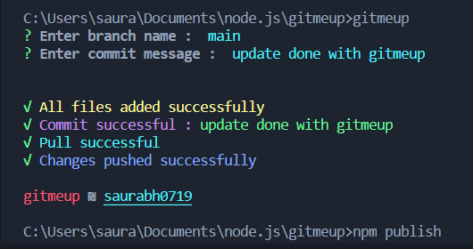

# gitmeup @1.0.1

cli tool to automate git commands. 

<p align="center">

  </p>

### Installation steps
Using npm 
```sh
$ npm install gitmeup -g
```
Run it inside any git repository:
```sh
$ gitmeup
```
